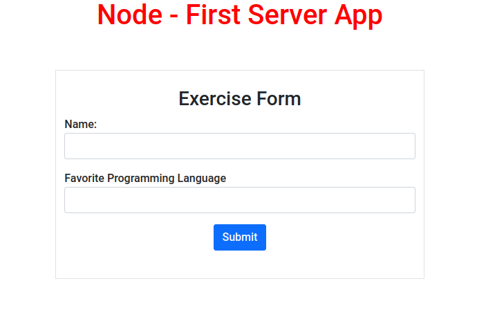
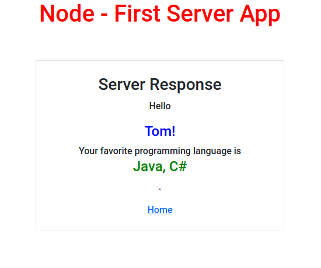
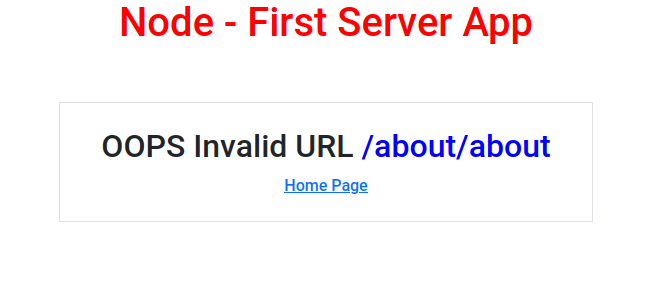

# Node: My First Node

### HomePage

### Response Page

### URL Error Page

## Exercise

In this exercise I will enhance the basic server side hello world exercise by adding some additional functionality.

Only the following `Node.js` modules will be used:

  - `http` (HTTP Server and Client)
  - `fs` (File System)
  - `ejs` (Embedded JavaScript Templating)
  - `webpack` (JavaScript module bundler)
  - `Bootstrap` (Used for styling)

1. A variable is provided at the top of the code in app.js called `serverPort` whre you can change the port the server listens on.
1. A EJS template will display a form where the user can enter their name and favorite progamming language.
1. Once the user responds to the question a hello world response page will display their name and favorite programming language.
1. A link is provided on the response page to return to the home page.
1. Local stylesheets are also served by the application.

URL's 
  - `/` - Redirects to `/about`
  - `/form-submission` - URL that the form submitts to.
  - `/styles/indexStyle.css` - Public stylesheet directory.
  - `/styles/responseStyle.css` - Public stylesheet directory.
  - `/styles/oopsStyle.css` - Public stylesheet directory.

  If the user attempts to go directly to the `/form-submission` url (without proper parameters) then a redirect will occur back to the url `/about`.

  If you enter a url that is not routed by the application you will receive a customized `oops` page with invalid URL information.

  ### Running the application:
  1. `npm run build:dev`
  1. A distributable is provided called `dist.zip` in the `dist` directory.
  1. Unzip with the following command: `unzip -d "Your Directory Name" dist.zip`.
  1. Navigate to the newly created directory.
  1. `npm install` to install all dependencies.
  1. `node main.js` will start the server from the directory name you have choosen.
